# PinBall
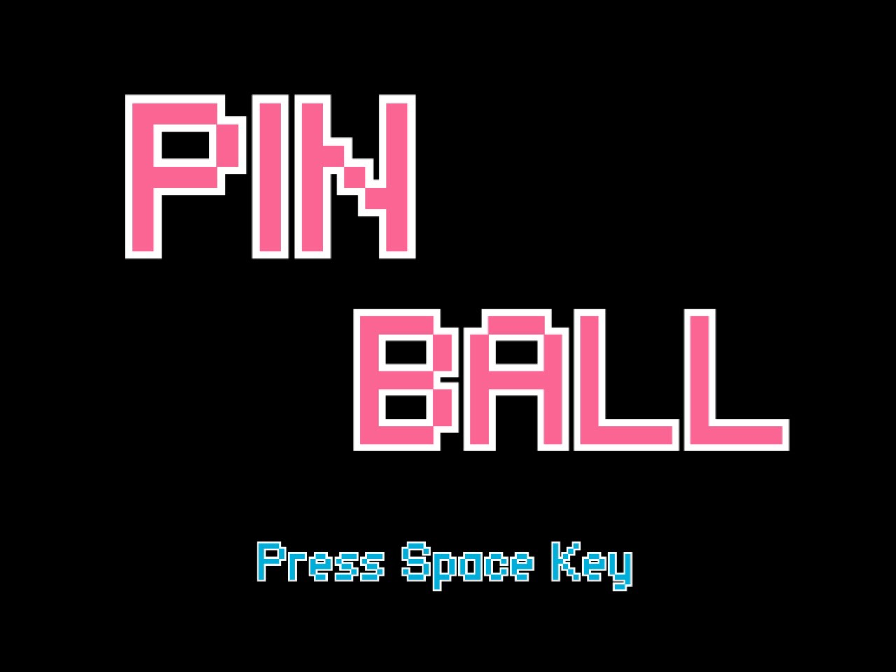
B2の授業の「プログラミング実践I」の最終課題で作成したJavaでのピンボールのゲームのコードが見つかったので，保存用でGitHubにあげておきます．

## 起動方法
Javaをインストールした環境下で，play.shを実行

## 操作方法
| キー | 操作 |
| --- | --- |
| SPACE | スタート，ボールの発射 |
| F | 左フリップの操作 |
| J | 右フリップの操作 |

# 発表スライド（一部）
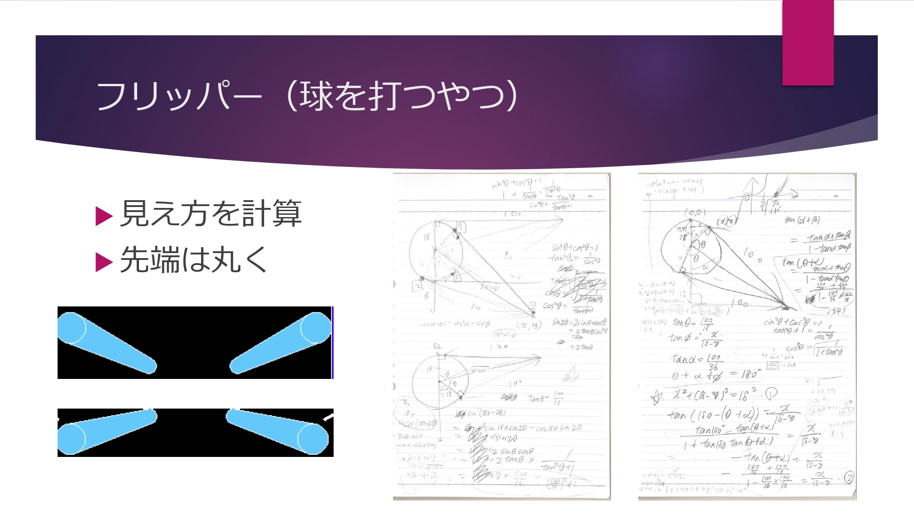
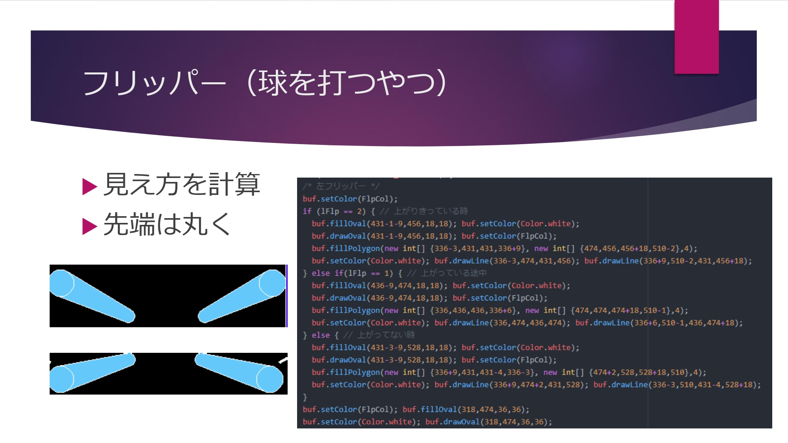
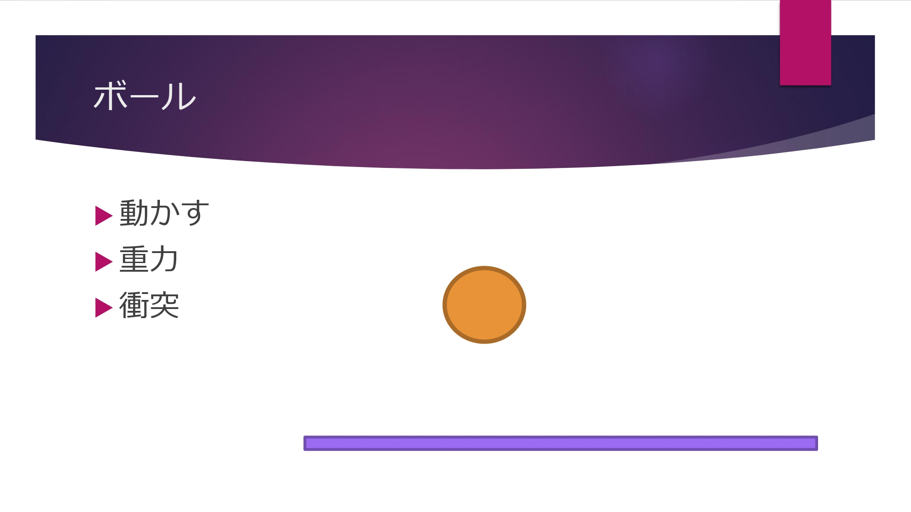
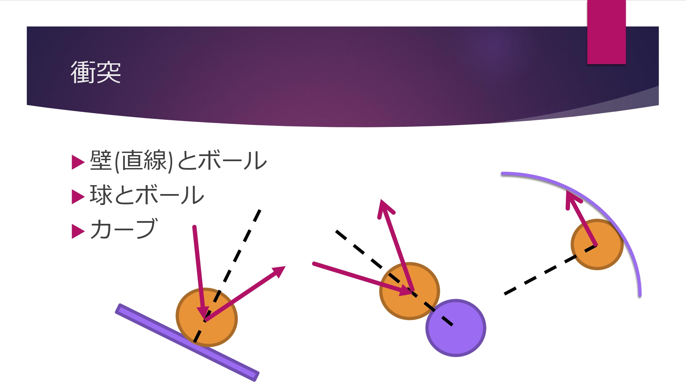
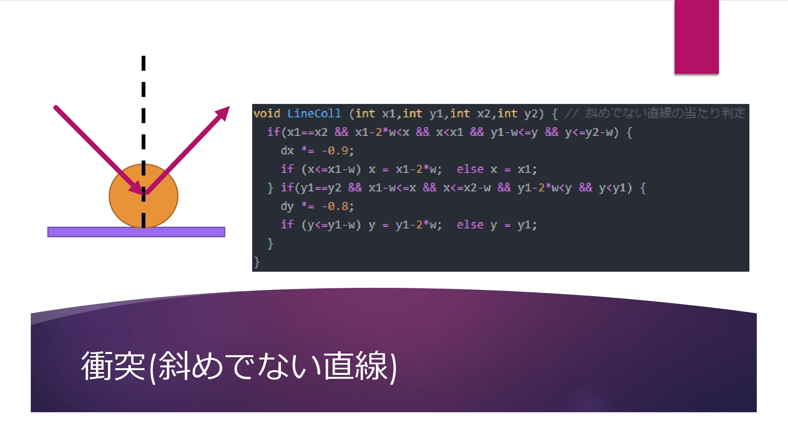
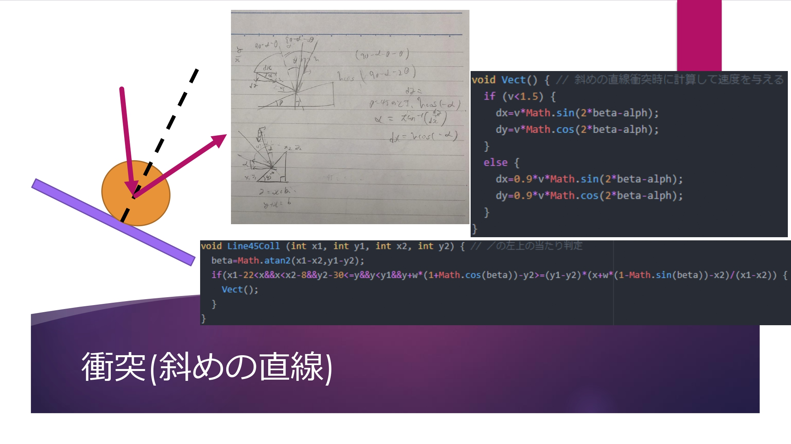
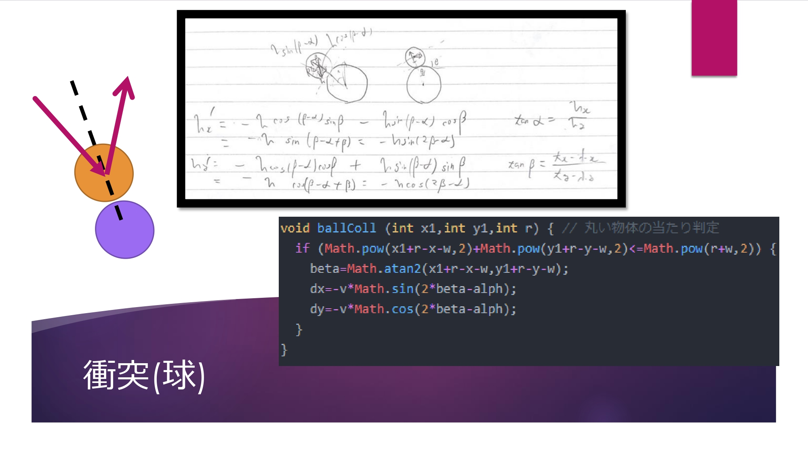
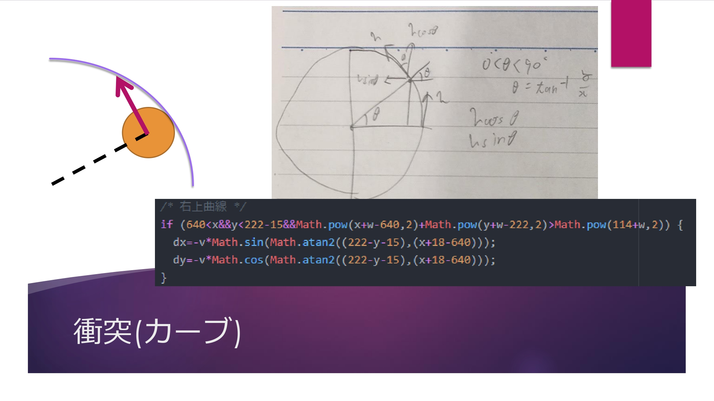
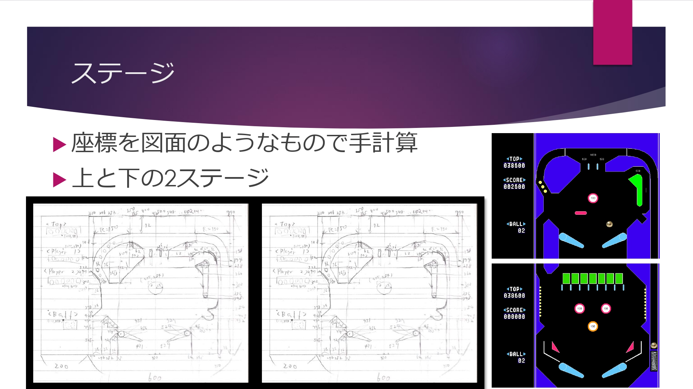
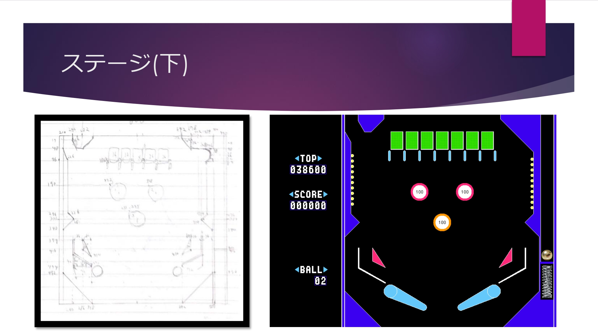
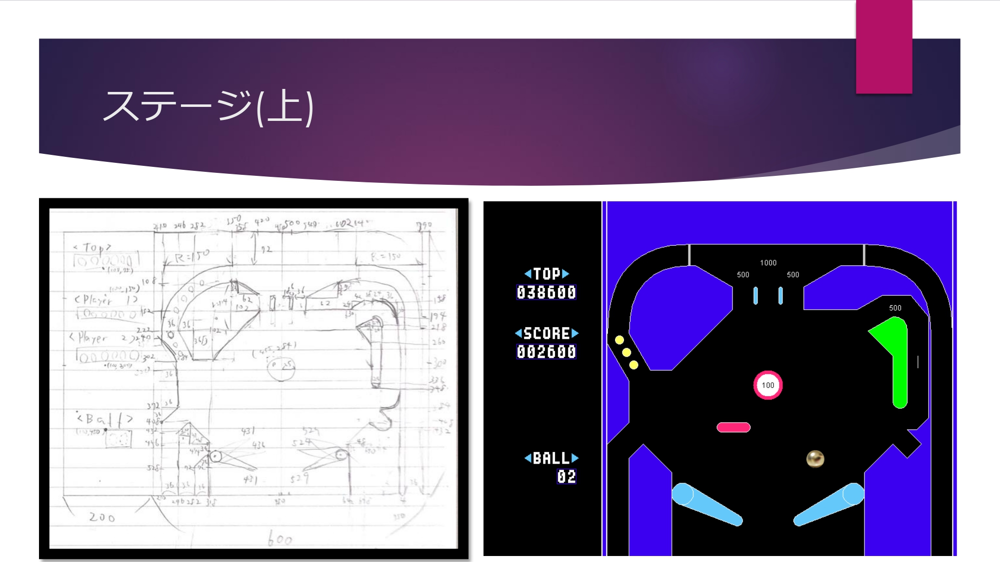